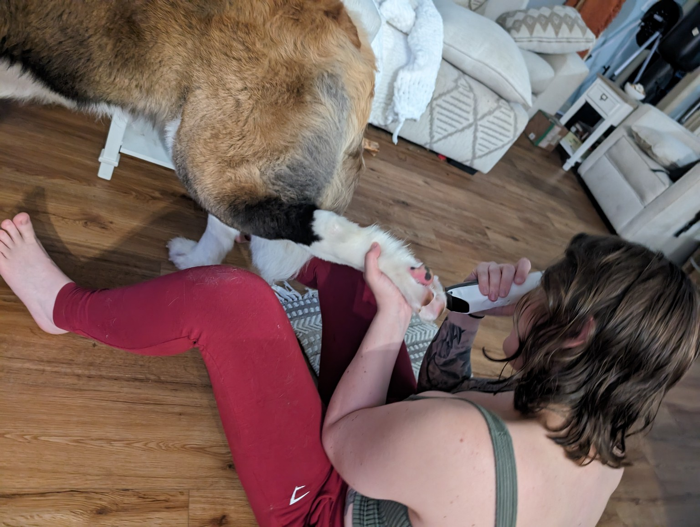

# Nail Care and Ant Bite Assessment for Kong

## Date: May 15, 2024

### Objective
To perform routine nail care and assess the healing progress of a previously treated ant bite on Kong's paw.

### Materials
- Nail clippers
- Electric trimmer
- Antiseptic solution
- Topical antibiotic ointment
- Bandages

### Procedure
1. **Nail Trimming:**
   - Kong's nails were carefully trimmed using nail clippers to prevent overgrowth and ensure comfort during movement.

2. **Paw Fur Trimming:**
   - The fur around Kong's paw, specifically the area with the previous ant bite, was trimmed using an electric trimmer. This allowed for better visibility and hygiene.

3. **Ant Bite Assessment:**
   - The trimmed area was inspected for signs of healing. The skin appeared less inflamed, and no signs of infection were present.
   - An antiseptic solution was applied to the bite area as a precaution.
   - A topical antibiotic ointment was applied to promote further healing.

4. **Bandaging:**
   - The paw was lightly bandaged to protect the area from dirt and irritation.

### Observations
- Kong was cooperative throughout the procedure.
- The ant bite showed significant improvement, with reduced redness and no discharge.
- Nail trimming was successful, and Kong showed no signs of discomfort post-procedure.

### Photos

### Video
Unfortunately, no video was available for this session.

### Conclusion
The routine nail care and ant bite assessment for Kong were conducted successfully. The ant bite is healing well, and Kong's nails are now properly trimmed, contributing to his overall well-being.

---

This entry accounts for 1 animal care hour.
